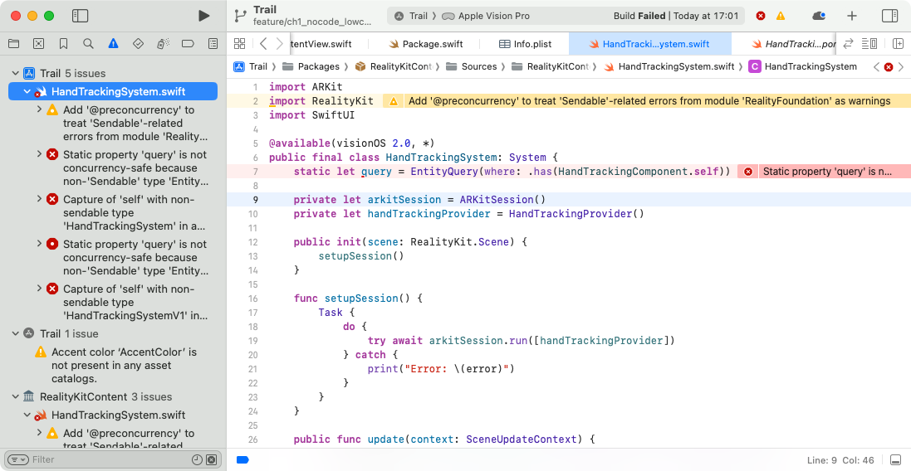
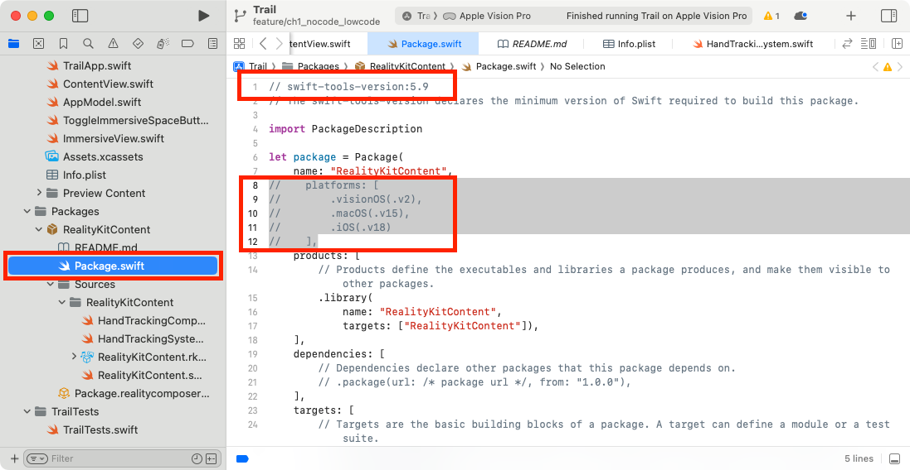

# トラブルシューティング

## インポートしたシステムにエラーが表示されて実行できない場合

Xcode 16 beta では、インポートした`HandTrackingSystem.swift`などのファイルに以下のようなエラーが表示され、実行できない場合があります（beta 3, 4 で確認）。

その場合は、Packages → RealityKitContent → Package.swift ファイルを開き、

* 1行目にある`swift-tools-version`を`5.9`に下げる
* 8〜12行目あたりの`platforms:[...]`をすべてコメントアウト

の対応を行うことで、ビルドし実行できるようになります。

